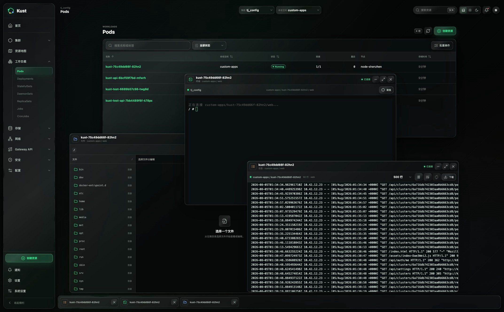
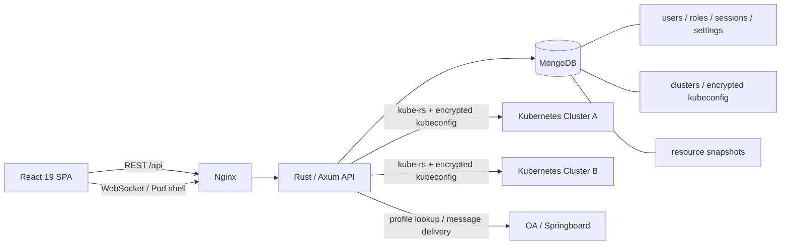
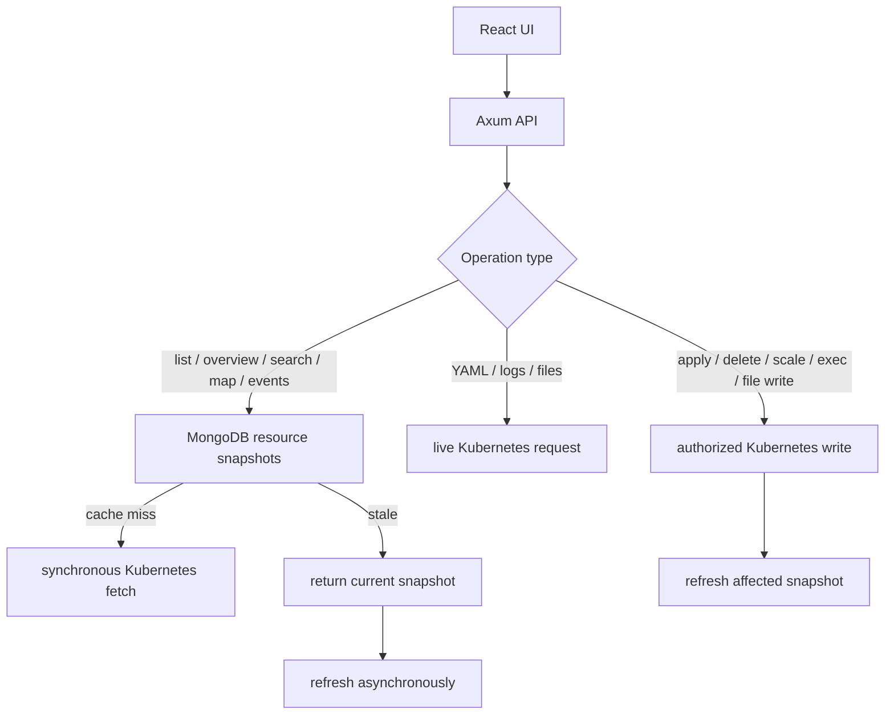

# Kust

Kust 是一个面向平台团队与 Kubernetes 运维人员的多集群 Web 控制台。它采用无 Agent 架构，不向目标集群安装 CRD 或控制器；后端保存并使用 kubeconfig 访问 Kubernetes API，前端围绕资源浏览、YAML 变更和 Pod 现场操作提供桌面式工作区。



> 本文描述当前代码已经实现的行为，不把演示界面或规划能力当作完成项。尚未完全落地的部分集中列在[当前边界](#当前边界)中。

## 项目定位

Kust 的重点不是监控大屏，而是日常运维闭环：

1. 在统一入口登录并选择集群、命名空间。
2. 浏览、搜索、筛选 Kubernetes 资源并查看真实 YAML。
3. 对资源执行 Server-Side Apply、删除或 Deployment 扩缩容。
4. 将 Pod 日志、终端和文件管理器打开为可并行操作的窗口。
5. 由管理员统一管理集群接入、账号角色、登录策略和缓存策略。

Kust 更适合受信任的组织内部环境和中等规模集群目录。它目前不是多租户控制面、完整可观测平台或 Kubernetes Operator。

## 当前能力

| 领域 | 当前实现 |
| --- | --- |
| 多集群 | 管理员添加、编辑和移除用户集群；启动时导入只读预设 kubeconfig；全局集群切换 |
| 资源浏览 | 30 类 Kubernetes 资源、命名空间过滤、搜索、状态筛选、排序、详情抽屉和批量选择 |
| 资源变更 | YAML 创建/更新、Server-Side Apply、删除、Deployment 扩缩容、写后快照刷新 |
| Pod 工具 | 日志查看、WebShell、文件浏览与 Monaco 编辑器、可拖拽多窗口和任务栏 |
| 派生视图 | 集群概览、工作负载聚合、事件通知、全局搜索、资源关系地图 |
| 身份安全 | 密码与 OA 登录、OA 用户资料注册、密码重置、TOTP、可信设备、三种内置角色 |
| 平台管理 | 用户启停、角色分配、本地账号重置码、注册/OA 策略、会话和缓存周期 |
| 个性化 | 系统/浅色/深色主题、玻璃效果开关、窗口关闭确认、账号级偏好同步 |

### 支持的资源

| 分组 | 资源 |
| --- | --- |
| 集群 | Namespace、Node、Event |
| 工作负载 | Pod、Deployment、StatefulSet、DaemonSet、ReplicaSet、Job、CronJob |
| 存储 | PersistentVolumeClaim、PersistentVolume、StorageClass |
| 网络 | Service、Endpoints、EndpointSlice、Ingress、NetworkPolicy |
| Gateway API | HTTPRoute、Gateway、GatewayClass、ReferenceGrant、GRPCRoute |
| 安全 | ServiceAccount、Role、RoleBinding、ClusterRole、ClusterRoleBinding |
| 配置 | ConfigMap、Secret |

资源列表读取 MongoDB 中的同步快照。打开单个资源 YAML、读取 Pod 日志/文件以及所有写操作会实时访问 Kubernetes API。

### 资源管理

- 顶部保留当前集群与每个集群最后选择的命名空间。
- 资源表支持名称/标签搜索、状态过滤、列排序和批量删除。
- 详情抽屉展示状态、元数据、标签、类型特有字段和实时 YAML。
- YAML 可复制、编辑并通过 Server-Side Apply 更新。
- Deployment 支持直接调整副本数。
- 全局搜索使用 `Cmd/Ctrl + K` 打开，合并页面、集群和资源快照结果。
- 资源地图依据 selector、Pod 名称、Ingress backend 和 HTTPRoute 引用推断依赖关系。

### Pod 工作区

Pod 详情可以打开三种独立工具窗口：

- **日志**：默认读取 500 行，可选择 100-10000 行；每 5 秒刷新；支持暂停、自动换行、立即刷新和下载日志。
- **终端**：xterm.js 通过 WebSocket 连接 Kubernetes exec，支持终端尺寸同步、主题切换和链接识别。
- **文件**：浏览目录、面包屑导航、Monaco 多语言编辑、保存文件、新建目录和删除；单次读取/写入上限为 4 MB。

窗口由 `react-rnd` 管理，支持拖动、缩放、层级聚焦、最小化、最大化、任务栏、断线重连和未保存变更保护。窗口目标与布局按用户保存在浏览器中；页面刷新后实时连接不会自动恢复，需要手动重连。

每个窗口会显示“正在连接、已连接、正在重连、已断开、异常、资源已删除”状态；文件内容发生变化时还会显示“未保存”。最小化后的任务栏项由类型图标、截断后的资源名和状态/操作图标组成：断线或异常时可重连，资源已删除时显示红色 `F` 并允许直接移除，关闭行为遵循用户的窗口二次确认设置。

Pod 文件功能通过容器内 `/bin/sh` 和常见命令执行，因此目标容器需要提供 `sh`、`cat`、`wc`、`mkdir`、`rm`、`dirname` 等基础工具。WebShell 同样要求容器内存在 `/bin/sh`。

### 身份与平台管理

- 本地密码登录，密码使用 Argon2 散列。
- OA 用户资料查询后注册，支持 OA/Springboard 登录链接和密码重置链接投递。
- Session、可信设备和一次性代码仅以 SHA-256 摘要保存在 MongoDB，并由 TTL 索引自动清理。
- 管理员强制启用 TOTP；管理员可信设备有效期为 1-15 天，普通用户为 1-30 天。
- 管理员可启停用户、分配角色、为本地账号生成一次性重置码。
- 平台设置可调整注册/OA 登录开关、默认角色、会话时长、资源缓存 TTL 和全量同步周期。

系统不会自动创建或提升首个管理员。新用户注册后需要由数据库运维显式赋予 `admin` 角色，管理员下次登录时会被要求绑定 TOTP。

## 权限模型

Kust 当前按内置角色名执行权限判断：

| 能力 | `viewer` | `operator` | `admin` |
| --- | :---: | :---: | :---: |
| 查看集群、资源、YAML、日志和文件 | 是 | 是 | 是 |
| 写入/删除资源、扩缩容、手动同步 | 否 | 是 | 是 |
| WebShell、写文件、建目录和删文件 | 否 | 是 | 是 |
| 添加、编辑和移除集群配置 | 否 | 否 | 是 |
| 用户、角色和平台设置管理 | 否 | 否 | 是 |
| 保存个人设置 | 是 | 是 | 是 |

MongoDB 中 `roles.permissions` 当前用于展示，后端尚未实现通用的权限表达式解析器。集群目录对所有已登录用户可见，`owner_user_id` 暂未参与访问控制。

Kust 权限与 kubeconfig 自身的 Kubernetes RBAC 会叠加生效。预设集群的“只读”仅表示不能在 Kust 中编辑或移除该集群配置，不表示 Kubernetes 资源只读。

## 系统架构



### 读写数据流



资源快照采用 stale-while-revalidate 语义：

1. 快照不存在时，请求会等待一次 Kubernetes 同步。
2. 快照仍在 TTL 内时，直接返回 MongoDB 数据。
3. 快照过期时，先返回现有数据，再异步刷新。
4. 后台任务还会按平台设置的周期遍历“集群 x 资源类型”进行全量同步。
5. 命名空间和标签过滤在后端内存中完成。

Secret/ConfigMap 快照只保存键名、状态和元数据，不缓存具体值。显式打开 Secret YAML 时仍会实时读取完整资源，最终可见范围取决于 kubeconfig 的 Kubernetes RBAC。

### MongoDB 集合

| 集合 | 用途 |
| --- | --- |
| `clusters` | 集群元数据、来源、加密 kubeconfig |
| `resource_snapshots` | 按集群和资源类型保存的读模型 |
| `users` / `roles` | 用户身份和内置角色 |
| `sessions` | Bearer 会话摘要和认证阶段 |
| `trusted_devices` | TOTP 免验证设备摘要 |
| `auth_codes` | 登录/重置一次性代码摘要 |
| `user_settings` | 主题、视觉、资源和窗口偏好 |
| `platform_settings` | 注册、OA、缓存和会话策略 |

后端启动时创建唯一索引、查询索引和 TTL 索引，并 seed `admin`、`operator`、`viewer` 三种角色。项目目前没有独立的数据库迁移框架。

## 前端设计

### 信息架构

- 桌面端采用 220px 可折叠侧栏、58px 顶栏和最大 1540px 内容区；侧栏折叠后为 64px。
- 左侧按 Kubernetes 领域组织资源，顶部承载集群、命名空间、全局搜索、主题、通知和账号入口。
- 主内容以紧凑工具栏、状态标签、统计摘要和数据表为主，避免大面积营销式版面。
- 资源详情使用侧边抽屉，编辑/确认使用模态框，Pod 工具使用独立窗口，三类任务保持清晰分层。

### 视觉语言

- 自定义 Liquid Glass 视觉系统：半透明面板、镜面高光、轻微红/蓝边缘色散和指针跟随光源。
- 浅色主题使用冷灰绿背景，深色主题使用近黑背景；绿色为主强调色，蓝、紫、橙、红用于类型和状态区分。
- SVG displacement 提供增强折射；Firefox、粗指针、移动端和 `prefers-reduced-motion` 环境会回退到普通玻璃效果。
- 主题、指针高光、折射、背景模糊和悬停动效都可以由用户设置控制。

### 交互与响应式

- Lucide 图标、语义表格、ARIA 标签、`focus-visible` 和分层 Escape 关闭已覆盖主要交互。
- 模态框、抽屉和工作区窗口统一处理关闭动画、二次确认和未保存内容。
- 1180px 以下搜索框收为图标，统计与卡片减少列数。
- 760px 以下侧栏变为遮罩抽屉，详情和 YAML 编辑器接近全屏，文件工具改为上下布局。
- 430px 以下进一步压缩操作文字和管理列表。

整体设计识别度高，且能支撑高频运维的扫描和多任务场景。代价是大量辅助文字位于 9-12px 区间，低分辨率或远距离阅读时可读性有限；重度玻璃合成也需要在目标浏览器和低性能设备上持续验证。

## 前端状态分层

| 状态 | 管理方式 | 持久化 |
| --- | --- | --- |
| 资源列表、概览、工作负载 | TanStack Query | 页面内存 |
| 集群目录 | `DataContext` | MongoDB |
| 用户与认证阶段 | `AuthContext` | Token 镜像到 localStorage |
| 主题和视觉效果 | `ThemeContext` / `VisualEffectsContext` | MongoDB + localStorage |
| 命名空间选择 | `NamespaceContext` | localStorage |
| Pod 工具窗口 | `WorkspaceWindowsContext` | 按用户保存窗口布局到 localStorage |
| 通知已读 | 页面组件状态 | 不持久化 |

主要 Provider 组合位于 `frontend/src/App.tsx`：Theme -> Visual Effects -> React Query -> Auth -> Data -> Preferences -> Toast -> Router -> Namespace -> Workspace Windows。

## 技术栈

| 层 | 技术 |
| --- | --- |
| 前端 | React 19、TypeScript 5.7、Vite 6、React Router 7、TanStack Query 5 |
| 运维交互 | xterm.js、Monaco Editor、react-rnd、yaml、Lucide React、QRCode |
| 后端 | Rust 2021、Tokio、Axum 0.8、kube-rs 0.98、k8s-openapi 1.30 |
| 数据与集成 | MongoDB 7、reqwest、serde、serde_yaml |
| 安全 | Argon2、AES-256-GCM、TOTP/HMAC-SHA1、SHA-256 |
| 交付 | Docker、Nginx、Docker Compose、Jenkins、Kubernetes Gateway API |

前端容器使用 Node.js 22 构建。后端 CI/容器固定 Rust 1.97.1，但仓库没有 `rust-toolchain.toml`，本机工具链不会自动锁定。

## 目录结构

```text
.
|-- frontend/
|   |-- src/pages/                 # 页面和路由视图
|   |-- src/components/            # UI、布局、资源和工作区组件
|   |-- src/*-context.tsx          # 认证、数据、偏好、主题、命名空间、窗口状态
|   |-- src/api.ts                 # REST/WebSocket 客户端
|   |-- src/styles.css             # 设计系统与响应式样式
|   `-- nginx.conf                 # 静态资源、API 和 WebSocket 反向代理
|-- backend/
|   |-- src/routes.rs              # 集群、资源、搜索、Pod 工具路由
|   |-- src/auth_routes.rs         # 身份、设置和管理员路由
|   |-- src/kubernetes.rs          # Kubernetes 资源和 exec 实现
|   |-- src/cache.rs               # MongoDB 快照读模型和同步
|   |-- src/state.rs               # 共享状态和预设 kubeconfig
|   |-- src/db.rs                  # 索引、角色和平台设置初始化
|   `-- src/config.rs              # 环境变量和本地配置文件
|-- deploy/k8s/                    # Deployment、Service、HTTPRoute 和 SSA 脚本
|-- compose.yaml                   # MongoDB + API + Web 本地基础栈
|-- Jenkinsfile                    # CI/CD 流水线
`-- .env.example                   # Compose 环境变量示例
```

## 快速启动

### Docker Compose 基础栈

```bash
cp .env.example .env
# 至少替换 KUST_ENCRYPTION_KEY，生产环境不要使用示例值
docker compose up --build
```

打开 [http://localhost:3000](http://localhost:3000)，或检查：

```bash
curl http://localhost:3000/api/health
```

MongoDB 数据保存在 `mongo-data` volume。`docker compose down` 会保留数据，`docker compose down -v` 会永久删除该 volume。

Compose 当前只注入基础 MongoDB、密钥、监听和 CORS 配置，没有挂载 OA 配置或预设 kubeconfig。全新数据库中也没有初始用户，因此基础栈可以完成服务健康检查，但不能直接体验完整登录与集群管理流程。

### 完整本地开发

先启动 MongoDB：

```bash
docker compose up -d mongo
```

启动后端：

```bash
cd backend
export MONGODB_URI=mongodb://127.0.0.1:27017
export MONGODB_DATABASE=kust
export KUST_ENCRYPTION_KEY='replace-with-at-least-24-random-characters'

# 至少配置一个可用的集群来源
export KUST_PRESET_CONFIG_PATH=/absolute/path/to/kubeconfig

# 新用户注册需要 OA 用户资料查询接口
export OA_USER_INFO_URL=https://oa.example/user-info

cargo run --locked
```

另一个终端启动前端：

```bash
cd frontend
npm ci
npm run dev
```

打开 [http://localhost:5173](http://localhost:5173)。Vite 会把 `/api` 和 WebSocket 请求代理到 `http://127.0.0.1:8080`。

后端没有 dotenv 依赖，直接执行 `cargo run` 不会自动加载仓库根目录的 `.env`；请使用 `export`、shell 工具或容器显式注入配置。

## 配置

| 变量 | 默认值 | 说明 |
| --- | --- | --- |
| `LISTEN_ADDR` | `0.0.0.0:8080` | Axum 监听地址 |
| `MONGODB_URI` | 配置文件或 `mongodb://127.0.0.1:27017` | MongoDB 连接串 |
| `MONGODB_DATABASE` | 配置文件或 `kust` | 数据库名 |
| `MONGODB_CONFIG_PATH` | `../../mongodb.txt` | MongoDB 键值配置文件 |
| `MONGODB_AUTH_SOURCE` | 文件值或 `admin` | MongoDB 认证库 |
| `KUST_ENCRYPTION_KEY` | 开发示例值 | 至少 24 字符；生产必须显式设置 |
| `CORS_ORIGIN` | `http://localhost:5173` | 单个允许的前端 Origin |
| `FRONT_URL` | `CORS_ORIGIN` | OA 回调/消息中的前端地址 |
| `KUST_PRESET_CONFIG_DIR` | 无 | 预设 kubeconfig 目录，优先于单文件变量 |
| `KUST_PRESET_CONFIG_PATH` | `../../tj_config` | 单个预设 kubeconfig 或目录 |
| `KUST_CACHE_TTL_SECONDS` | `45` | 首次创建平台设置时的缓存 TTL，范围 15-600 |
| `KUST_CACHE_SYNC_SECONDS` | `60` | 首次创建平台设置时的同步周期，范围 15-3600 |
| `OA_CONFIG_PATH` | `../../oa_auth.txt` | OA/Springboard 配置文件 |
| `OA_USER_INFO_URL` | 无 | `GET <URL>?itcode=<username>` 用户资料查询接口 |
| `SPRINGBOARD_URL` | 内置 OA 地址 | OA 消息投递入口 |
| `SPRINGBOARD_APP` | `kust` | OA 应用标识 |
| `KUST_EXPOSE_LOCAL_RESET_CODES` | `false` | 仅本地调试时返回登录/重置码 |
| `KUST_APP_HOSTING_ENABLED` | `false` | 启用 Git 仓库到 Kubernetes 的应用托管能力 |
| `KUST_JENKINS_URL` | 无 | Jenkins 根地址，例如 `http://jenkins.internal` |
| `KUST_JENKINS_USER` | 无 | 调用受控应用构建 Job 的 Jenkins 用户 |
| `KUST_JENKINS_API_TOKEN` | 无 | Jenkins API Token，只能由后端运行环境读取 |
| `KUST_JENKINS_APP_JOB` | `kust_customer_apps/application-hosting` | 固定的通用应用构建 Job 名称 |
| `KUST_APP_CALLBACK_BASE_URL` | `FRONT_URL` | Jenkins 可访问的 Kust API 根地址；建议使用集群内 Service 地址 |
| `KUST_APP_DEFAULT_GATEWAY_NAME` | 无 | 托管应用唯一允许使用的 Gateway 名称 |
| `KUST_APP_DEFAULT_GATEWAY_NAMESPACE` | `default` | 该 Gateway 的命名空间 |
| `KUST_APP_DEFAULT_ROUTE_HOST` | 无 | 托管 HTTPRoute 默认 Host，也是允许的域名边界 |
| `KUST_APP_ROUTE_PREFIX` | `/apps` | 托管 HTTPRoute 唯一允许使用的路径前缀 |
| `KUST_APP_HARBOR_REPOSITORY_PREFIX` | 无 | 托管应用镜像前缀，例如 `harbor.internal/kust-apps` |
| `KUST_APP_IMAGE_PULL_SECRET` | 无 | 平台预置在允许命名空间中的 Harbor 拉取 Secret 名称 |
| `KUST_APP_ALLOWED_NAMESPACES` | 无 | 逗号分隔的托管应用命名空间白名单；为空时不额外限制 |
| `KUST_APP_ROLLOUT_TIMEOUT_SECONDS` | `180` | Deployment 与 HTTPRoute 就绪的最长等待时间，范围 30-900 秒 |
| `RUST_LOG` | `kust_api=info,tower_http=info` | Rust tracing 过滤器 |
| `VITE_API_URL` | 当前站点的 `<base>/api` | 前端编译时 API 根地址 |
| `API_UPSTREAM` | `api:8080` | 前端容器 Nginx 的 API 上游 |
| `APP_BASE_PATH` | `/` | 前端容器运行时 URL 前缀 |

`KUST_CACHE_TTL_SECONDS` 和 `KUST_CACHE_SYNC_SECONDS` 只用于首次创建全局平台设置；初始化后以 MongoDB 中管理员保存的值为准。

默认相对配置路径从 `backend` crate 的编译位置解析。生产部署应使用绝对路径或容器 Secret 挂载，避免依赖本地目录布局。

## 应用托管

应用托管将 Git 仓库发布为 Kust 管理的 Kubernetes 应用。用户在“应用托管”中提供仓库、分支、构建方式、集群、命名空间和 HTTPRoute 路径；系统保存这些受限规格，并生成：

```text
Git repository -> Jenkins build -> Harbor digest
  -> Kust callback -> Deployment + Service + HTTPRoute
```

Kust 是控制面：应用定义、Git 凭证元数据、构建记录和审计日志都保存在 MongoDB。Jenkins 仅用于隔离构建与推送镜像，**不持有 Kubernetes 集群凭证**。Jenkins 将不可变镜像 digest 回调给 Kust 后，Kust 才使用目标集群已加密保存的 kubeconfig 以 Server-Side Apply 创建或更新资源。

### 支持的构建方式

| 模式 | 用途 | 受控执行方式 |
| --- | --- | --- |
| `dockerfile` | 仓库已容器化 | 使用仓库根目录或子目录的 Dockerfile |
| `buildpack` | 常见 Go/Java/Node/Python 服务 | Paketo Buildpacks |
| `static` | Vite、React、Vue 等静态站点 | 执行构建命令并封装为受控 Nginx 镜像 |
| `custom` | 非标准静态构建 | 仅运行填写的构建命令并封装静态产物 |

静态镜像固定监听 `8080`，与 Kust 生成的 Service、健康检查和 HTTPRoute 后端端口一致。用户不能提交任意 Kubernetes YAML、ServiceAccount、HostPath、特权容器、Secret 挂载、Gateway 或集群范围资源。

### Git 凭证与私有仓库

应用用户可保存 Git Access Token 或 SSH Deploy Key。密钥使用 Kust 的 AES-256-GCM 密钥加密后写入 MongoDB，列表和 API 响应永远不会返回密钥内容。每次构建使用两个独立令牌：源码租约仅可在 10 分钟内读取一次，回调令牌只可反馈当前构建且最长有效 60 分钟。令牌均仅保存哈希，构建结束后的成功、失败或取消状态不再允许读取源码配置。

仓库 URL 不能包含嵌入式用户名密码。建议为 GitLab 创建只读 Project Access Token 或 Deploy Key，并只授予目标项目的 `read_repository` 权限。

### Jenkins Job 配置

在本地 Jenkins 创建固定 Pipeline Job：

```text
kust_customer_apps/application-hosting
```

Pipeline script from SCM 指向本仓库的：

```text
ci/Jenkinsfile.application-hosting
```

该 Job 需要以下 Jenkins Credentials：

| Credential ID | 类型 | 用途 |
| --- | --- | --- |
| `infra_harbor_auth` | Username with password | 仅推送受控 Harbor 应用镜像 |

Jenkins agent 需要 `git`、`curl`、`jq`、Docker daemon；使用 `buildpack` 模式时还需要 `pack` CLI。`KUST_SOURCE_TOKEN` 与 `KUST_CALLBACK_TOKEN` 由 Kust 在触发 Job 时传入，Job 无需保存长期 Kust 回调 Secret。该 Job 不应使用 `tianjin_k8s_admin_token`，也不应 checkout 或执行目标仓库内的 `Jenkinsfile`。目标仓库属于不可信输入，必须运行在临时隔离 Agent 上，不能使用带生产凭据或宿主机网络的共享执行器。

生产 runtime Secret 需要补充可选键 `jenkins-url`、`jenkins-user`、`jenkins-api-token`。部署模板已引用这些键；未配置 Jenkins 时，应用可保存但构建将保持排队。目标命名空间还需预先存在 `KUST_APP_IMAGE_PULL_SECRET` 指定的 Harbor 拉取 Secret。

### GitLab 自动部署

启用应用的“自动部署”后，在应用详情中点击“生成 Webhook”，将一次性显示的 URL 与 Secret 填入 GitLab 的 **Settings > Webhooks**，勾选 **Push events** 与需要的 **Tag push events**。Kust 只接受该应用配置分支或 Tag 的事件，同一应用已有排队或运行构建时会拒绝重复触发。重新生成会立即使旧 Secret 失效。

### Gateway 与路由策略

第一阶段建议使用一个平台维护的域名和路径规则，例如：

```text
http://k8s.1oa.com.cn/apps/<team>/<application>
```

配置 `KUST_APP_DEFAULT_ROUTE_HOST=k8s.1oa.com.cn` 后，后端只接受该 Host 或其受控子域。`KUST_APP_ROUTE_PREFIX` 默认是 `/apps`，每个新应用的空路径会自动归一化为 `/apps/<application-slug>`，平台拒绝 `/`、`/kust` 和其他前缀，避免抢占 Kust 自身路由。Gateway 引用由 `KUST_APP_DEFAULT_GATEWAY_NAME` 和 `KUST_APP_DEFAULT_GATEWAY_NAMESPACE` 固定，普通用户不能覆盖。目标 Gateway 必须允许指定命名空间中的 HTTPRoute 绑定；跨命名空间 Gateway 环境还需要按 Gateway API 策略预先配置允许引用的权限。

## API 概览

所有受保护的 REST API 使用 `Authorization: Bearer <token>`。

| 方法 | 路径 | 用途 |
| --- | --- | --- |
| `GET` | `/api/health` | API 与 MongoDB 健康状态 |
| `GET` | `/api/auth/capabilities` | 注册与 OA 登录能力 |
| `POST` | `/api/auth/register/lookup` | 查询注册所需的 OA 用户资料 |
| `POST` | `/api/auth/register` | 注册并创建会话 |
| `POST` | `/api/auth/login`、`/api/auth/logout` | 密码登录与退出 |
| `POST` | `/api/auth/oa/request`、`/api/auth/code` | OA 登录链接与代码登录 |
| `POST` | `/api/auth/password/request`、`/api/auth/password/reset` | 密码重置 |
| `GET` | `/api/auth/2fa/setup` | 获取 TOTP 绑定信息 |
| `POST` | `/api/auth/2fa/verify` | 验证 TOTP 并完成绑定/登录 |
| `GET/PUT` | `/api/settings` | 个人设置 |
| `GET/PUT` | `/api/admin/settings` | 平台设置 |
| `GET` | `/api/admin/users`、`/api/admin/roles` | 用户和角色 |
| `GET` | `/api/admin/audit-logs` | 管理员审计日志 |
| `PATCH` | `/api/admin/users/{id}/roles`、`/api/admin/users/{id}/status` | 角色与账号状态管理 |
| `POST` | `/api/admin/users/{id}/reset-code` | 为本地账号生成重置码 |
| `GET/POST` | `/api/clusters` | 集群列表与添加 |
| `PATCH/DELETE` | `/api/clusters/{id}` | 编辑或移除集群配置 |
| `GET/PUT` | `/api/clusters/{id}/members` | 集群成员 ACL（管理员） |
| `GET` | `/api/clusters/{id}/overview` | 集群概览 |
| `GET` | `/api/clusters/{id}/metrics/summary` | Metrics API 汇总 |
| `GET` | `/api/clusters/{id}/discovery` | Kubernetes Discovery 资源元数据 |
| `GET` | `/api/clusters/{id}/resources/{kind}` | 资源快照列表 |
| `GET/DELETE` | `/api/clusters/{id}/resources/{kind}/{namespace}/{name}` | 实时 YAML 或删除资源 |
| `PATCH` | `/api/clusters/{id}/deployments/{namespace}/{name}/scale` | Deployment 扩缩容 |
| `GET` | `/api/clusters/{id}/pods/{namespace}/{name}/logs` | Pod 日志 |
| `GET` | `/api/clusters/{id}/pods/{namespace}/{name}/containers` | Pod 容器和 Init 容器 |
| `GET` | `/api/clusters/{id}/pods/{namespace}/{name}/shell` | Pod WebSocket 终端 |
| `GET/PUT/DELETE` | `/api/clusters/{id}/pods/{namespace}/{name}/file` | Pod 文件读写和删除 |
| `GET` | `/api/clusters/{id}/pods/{namespace}/{name}/files` | Pod 目录浏览 |
| `POST` | `/api/clusters/{id}/pods/{namespace}/{name}/directory` | Pod 目录创建 |
| `POST` | `/api/clusters/{id}/apply` | Server-Side Apply YAML |
| `GET` | `/api/search` | 跨集群资源搜索 |
| `GET` | `/api/clusters/{id}/map` | 缓存资源关系地图 |
| `POST` | `/api/clusters/{id}/sync` | 手动同步全部支持资源 |
| `GET` | `/api/notifications` | 当前用户通知列表 |
| `PATCH` | `/api/notifications/{id}/read` | 标记通知已读 |
| `POST` | `/api/notifications/read-all` | 全部标记已读 |

## 验证

前端：

```bash
cd frontend
npm ci
npm run lint
npm run build
```

后端：

```bash
cd backend
cargo fmt --all -- --check
cargo clippy --all-targets --locked -- -D warnings
cargo test --locked
```

可选的真实集群 smoke test：

```bash
KUST_TEST_KUBECONFIG=/absolute/path/to/kubeconfig \
  cargo test --locked live_cluster_resource_smoke_test -- --ignored
```

当前前端没有 `test` 脚本或自动化测试。后端当前有 9 个测试，其中 1 个真实集群 smoke test 默认忽略。

## CI/CD 与部署

- 所有分支执行 Rust fmt、Clippy、测试，以及前端 lint 和构建。
- `main` 分支为 `linux/amd64` 构建前后端镜像并推送到 Harbor。
- 镜像使用 `sha-<12位 Git SHA>` 标签，部署使用不可变 registry digest。
- Jenkins 参数控制测试和生产部署；两者都启用时按测试环境、生产环境顺序执行。
- 测试环境使用 `/kust_test` 和独立 MongoDB 数据库，生产环境使用 `/kust`。
- Kubernetes 模板只部署 API、Web、Service 和 Gateway API HTTPRoute，不部署 MongoDB。
- 运行环境需要预先创建镜像拉取 Secret，以及分别面向测试/生产的 runtime Secret。
- runtime Secret 包含 MongoDB 配置、OA 配置、预设 kubeconfig 和独立加密密钥。
- `deploy/k8s/apply.sh` 不依赖 kubectl；它通过 Kubernetes HTTP API 执行 Server-Side Apply，等待 Deployment 就绪并检查公开健康端点。
- 前端容器启动时替换 `APP_BASE_PATH`，同一静态镜像可以部署到不同 URL 前缀。

当前流水线部署目标：

| 环境 | 访问地址 | 资源前缀 | MongoDB 数据库 |
| --- | --- | --- | --- |
| 测试 | [http://k8s.1oa.com.cn/kust_test/](http://k8s.1oa.com.cn/kust_test/) | `kust-test` | `kust_test` |
| 生产 | [http://k8s.1oa.com.cn/kust/](http://k8s.1oa.com.cn/kust/) | `kust` | `kust` |

Jenkins 需要 Harbor 用户名密码凭据 `infra_harbor_auth`，以及 Secret text 类型的 Kubernetes Token `tianjin_k8s_admin_token`。`custom-apps` 命名空间需要预先提供 `kust-harbor` image pull secret，以及 `kust-runtime`、`kust-test-runtime` 两个运行时 Secret；运行时 Secret 挂载 `mongodb.txt`、`oa_auth.txt`、`tj_config` 和各环境独立的 `encryption-key`。

注册用户查询地址由 Jenkins 的 `USER_INFO_URL` 传入并映射为后端的 `OA_USER_INFO_URL`。当前集群通过 `USER_INFO_HOST` 和 `USER_INFO_HOST_IP` 为 API Pod 配置 `hostAliases`，用于访问无法由 Pod DNS 解析的内部 OA 地址。

当前 Kubernetes 模板中 API 和 Web 都是单副本。`apply.sh` 使用 `curl --insecure` 连接既定内部 Kubernetes API，这是现有内部部署假设，不适合直接照搬到不受信任网络。

## 安全说明

- kubeconfig 和 TOTP Secret 使用 AES-256-GCM 加密后写入 MongoDB，kubeconfig 不进入 API 响应或前端状态。
- `KUST_ENCRYPTION_KEY` 变更前必须迁移已有密文，否则后端将无法解密现有集群和 TOTP 配置。
- 会话和可信设备令牌保存在浏览器 localStorage；生产必须使用 HTTPS。
- WebSocket API 将 access token 放在查询参数中；生产必须使用 WSS，并确保反向代理不记录查询字符串。
- viewer 仍可读取实时资源 YAML、日志和 Pod 文件；打开 Secret YAML 可能返回敏感值，应通过 Kubernetes RBAC 限制共享 kubeconfig 权限。
- admin/operator 的写能力仍受 kubeconfig 对应 Kubernetes RBAC 限制。
- Pod 文件功能能够修改和递归删除容器内文件，只应开放给受信任的运维角色。
- `KUST_EXPOSE_LOCAL_RESET_CODES` 只能用于本地开发，生产必须保持关闭。
- 集群成员 ACL 和审计日志已在应用层生效；API rate limiting、细粒度自定义角色执行引擎仍建议由网关和后续权限模块补足。

## 当前边界

### 产品与交互

- **项目页是展示分组**：当前用固定名称和前三个集群拼装，不存在项目后端模型、创建、编辑或成员管理。
- **通知中心**：通知已提供 MongoDB 持久化读状态和已读接口；Kubernetes Event 仍按缓存同步周期汇聚，实时推送可在后续接入 SSE/WebSocket。
- **CPU/内存指标**：概览页通过 Kubernetes Metrics API 读取 Node/Pod 使用量；集群未安装 metrics-server 或权限不足时显示不可用。
- **个人设置消费**：`autoRefresh` 控制资源列表刷新，`pageSize` 控制浏览器分页。
- **权限 UI 尚未完全收口**：部分详情抽屉和 Pod 工具仍会向 viewer 展示写操作或终端入口，后端会返回 403，但界面会产生“看得到、做不了”的体验。
- **工作负载表不含 Pod**：统计卡包含 Pod，当前聚合表从第二个资源组开始展开，因此不会列出 Pod。
- **移动端上下文切换受限**：760px 以下顶栏隐藏集群/命名空间选择器，侧栏没有等价的命名空间入口。
- **文件工具边界**：当前提供容器元数据接口、目录创建、读写和删除；上传/下载进度和二进制文件传输仍待补强。

### 架构与规模

- 后台同步使用周期轮询而不是 watch/informer，缓存型页面不保证与 Kubernetes API 瞬时一致。
- 全量同步按“集群 x 资源类型”顺序执行；API 多副本会各自启动同步任务，没有 leader election。
- 每次实时 Kubernetes 请求都会解密 kubeconfig 并创建 Client，当前没有 Client 连接池。
- 全局搜索会把匹配范围内的快照读入应用进程后评分，资源表也在浏览器中全量排序/过滤，没有服务端分页或虚拟化。
- 资源地图使用固定宽度列式布局并限制部分资源数量，适合运维定位，不是完整实时拓扑引擎。
- Rust DTO 与 TypeScript 类型手工维护，当前没有 OpenAPI 或生成式客户端。
- `kubernetes.rs`、`auth_routes.rs` 和 `routes.rs` 体积较大，路由、服务与存储职责仍有进一步拆分空间。
- 前端缺少自动化测试；现有后端测试主要覆盖配置解析、加密、OA 响应解析和少量 Kubernetes 工具逻辑。

## License

GPL-3.0-or-later
