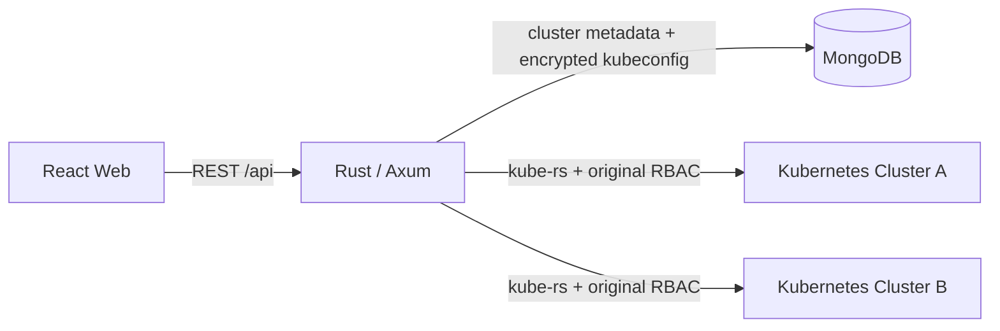

# Kust

Kust 是一个前后端分离的 Kubernetes 多集群管理控制台。产品结构参考 Headlamp 桌面应用：多集群首页、可折叠资源导航、资源概览与表格、详情抽屉、YAML 编辑、Pod 日志和 Deployment 扩缩容；视觉采用轻量玻璃拟态，并提供系统、浅色、深色三种主题模式。

## 技术栈

- 前端：React 19、TypeScript、Vite、TanStack Query、React Router、Lucide
- 后端：Rust、Axum、kube-rs、MongoDB 官方 Rust Driver
- 数据库：MongoDB 7
- 部署：Docker Compose、Nginx

## 功能

- 多集群接入、切换与移除
- kubeconfig AES-256-GCM 加密存储
- 集群概览：CPU、内存、Pod、Node 与 Events
- Workloads：Pods、Deployments、StatefulSets、DaemonSets、ReplicaSets、Jobs、CronJobs
- Storage：PVC、PV、StorageClass
- Network：Service、Endpoints、EndpointSlice、Ingress、NetworkPolicy
- Security：ServiceAccount、Role、RoleBinding、ClusterRole、ClusterRoleBinding
- Config：ConfigMap、Secret
- 资源详情、标签与元数据、YAML 查看/更新、批量删除
- Pod 日志、Deployment 扩缩容、Server-Side Apply
- 资源关系地图、通知中心、全局搜索
- 演示数据与实时后端模式

## 架构



MongoDB 不保存 Kubernetes 资源副本。后端按请求解密对应 kubeconfig 并连接目标 API Server，因此访问能力仍由 kubeconfig 身份及集群 RBAC 决定。

## 快速预览

前端默认使用演示数据，不依赖 MongoDB 或 Kubernetes：

```bash
cd frontend
npm install
npm run dev
```

打开 [http://localhost:5173](http://localhost:5173)。在“设置 > 数据源”中可以切换演示数据与实时后端。

## 完整环境

```bash
cp .env.example .env
# 修改 .env 中的 KUST_ENCRYPTION_KEY
docker compose up --build
```

打开 [http://localhost:3000](http://localhost:3000)。MongoDB 数据写入 `mongo-data` volume。

## 本地开发

先启动 MongoDB，再运行后端：

```bash
cd backend
export MONGODB_URI=mongodb://127.0.0.1:27017
export MONGODB_DATABASE=kust
export KUST_ENCRYPTION_KEY='replace-with-at-least-24-random-characters'
cargo run
```

另一个终端运行前端实时模式：

```bash
cd frontend
VITE_DEMO_MODE=false npm run dev
```

Vite 会把 `/api` 代理到 `http://127.0.0.1:8080`。

## API

| 方法 | 路径 | 用途 |
| --- | --- | --- |
| `GET` | `/api/health` | 服务与数据库状态 |
| `GET/POST` | `/api/clusters` | 查询或添加集群 |
| `DELETE` | `/api/clusters/:id` | 移除集群配置 |
| `GET` | `/api/clusters/:id/overview` | 集群概览 |
| `GET` | `/api/clusters/:id/resources/:kind` | 查询资源 |
| `GET/DELETE` | `/api/clusters/:id/resources/:kind/:namespace/:name` | 读取 YAML 或删除资源 |
| `PATCH` | `/api/clusters/:id/deployments/:namespace/:name/scale` | Deployment 扩缩容 |
| `GET` | `/api/clusters/:id/pods/:namespace/:name/logs` | Pod 日志 |
| `POST` | `/api/clusters/:id/apply` | Server-Side Apply YAML |

## 验证

```bash
cd frontend
npm run build
npm run lint

cd ../backend
cargo fmt --all -- --check
cargo clippy --all-targets -- -D warnings
cargo test
# Optional live smoke test against the local tj_config cluster
KUST_TEST_KUBECONFIG=../../tj_config cargo test live_cluster_resource_smoke_test -- --ignored
```

## 安全说明

- 生产环境必须设置高强度 `KUST_ENCRYPTION_KEY`，更换密钥前需要迁移已保存的 kubeconfig。
- Kust 当前不内置用户身份系统。对外部署时应放在 OIDC/SSO 反向代理之后，并限制网络入口。
- 用户能看到和操作的资源取决于所保存 kubeconfig 的 RBAC 权限；不要录入权限高于使用者需要的凭据。
- Secret 数据只在显式打开其 YAML 时由 Kubernetes API 返回，资源列表不会展示 Secret 内容。

## License

GPL-3.0-or-later
