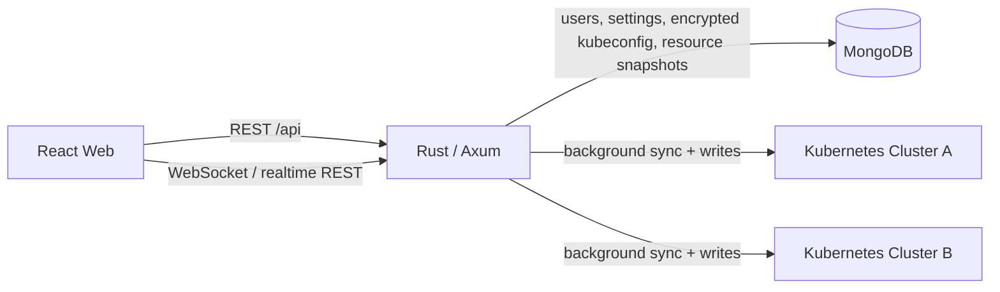

# Kust

Kust 是一个前后端分离的 Kubernetes 多集群管理控制台。产品结构参考 Headlamp 桌面应用：多集群首页、可折叠资源导航、资源概览与表格、详情抽屉、YAML 编辑、Pod 日志和 Deployment 扩缩容；视觉采用轻量玻璃拟态，并提供系统、浅色、深色三种主题模式。

## 技术栈

- 前端：React 19、TypeScript、Vite、TanStack Query、React Router、Lucide
- 后端：Rust、Axum、kube-rs、MongoDB 官方 Rust Driver
- 数据库：MongoDB 7
- 部署：Docker Compose、Nginx、Jenkins、Kubernetes Gateway API

## 功能

- 多集群接入、切换与移除
- 只读 kubeconfig 预设：启动时从本地文件或目录加密导入 MongoDB，后端强制禁止修改和删除，凭据不进入 API 响应或前端
- kubeconfig AES-256-GCM 加密存储
- MongoDB 资源读模型：后台同步 Kubernetes 资源快照，列表、概览、搜索、通知和地图只读取数据库缓存
- OA 用户资料查询注册、密码登录、OA 登录、密码重置、内置管理员/运维/只读角色
- TOTP 双重认证：管理员强制绑定，管理员免验证期 1-15 天，普通用户可关闭或设置 1-30 天
- 用户设置同步：主题、玻璃效果、刷新、分页和安全设置绑定账号
- 集群概览：CPU、内存、Pod、Node 与 Events
- Workloads：Pods、Deployments、StatefulSets、DaemonSets、ReplicaSets、Jobs、CronJobs
- Storage：PVC、PV、StorageClass
- Network：Service、Endpoints、EndpointSlice、Ingress、NetworkPolicy
- Gateway API：HTTPRoute、Gateway、GatewayClass、ReferenceGrant、GRPCRoute
- Security：ServiceAccount、Role、RoleBinding、ClusterRole、ClusterRoleBinding
- Config：ConfigMap、Secret
- 资源详情、标签与元数据、YAML 查看/更新、批量删除
- Pod 日志、Deployment 扩缩容、Server-Side Apply
- Pod WebShell（xterm.js + Kubernetes exec）与 WebFile（Monaco Editor，支持目录、读取、保存、删除）
- 资源关系地图、通知中心、全局搜索

## 架构



MongoDB 是前端资源查询的主要数据源。后端按 `KUST_CACHE_SYNC_SECONDS` 周期同步资源；缓存缺失时同步等待，缓存过期时先返回已有数据并在后台刷新。资源写入 Kubernetes 成功后会刷新对应快照。Secret/ConfigMap 列表只缓存键名和元数据，不缓存内容。

敏感或交互式操作保持实时直连 Kubernetes：资源 YAML、Pod 日志、WebShell、WebFile，以及所有资源写操作。访问能力仍受保存 kubeconfig 的 Kubernetes RBAC 约束，并叠加 Kust 的 admin/operator/viewer 角色权限。

预设 kubeconfig 只由后端读取。可通过 `KUST_PRESET_CONFIG_DIR` 指定目录，或通过 `KUST_PRESET_CONFIG_PATH` 指定单个文件；未设置时本地开发默认读取仓库旁的 `tj_config`。每次启动会按文件与 context 的稳定键同步到 MongoDB，并清理已移除的预设。

未设置 `MONGODB_URI` 时，后端默认读取仓库旁的 `mongodb.txt`。该文件支持带引号的值和 `MONGO_DB_AUTH_SOURCE`，认证库默认是 `admin`。OA/Springboard 配置优先读取环境变量，也可从 `OA_CONFIG_PATH`（默认仓库旁 `oa_auth.txt`）中的字符串赋值读取。新用户注册要求配置 `OA_USER_INFO_URL`（或配置文件中的 `USER_INFO_URL`），后端按 `GET <URL>?itcode=<username>` 查询并校验用户资料。

## 快速预览

完整功能需要后端、MongoDB 和至少一个用户账号：

```bash
cd frontend
npm install
npm run dev
```

打开 [http://localhost:5173](http://localhost:5173)。前端资源数据统一由后端的 MongoDB 读模型提供。

## 完整环境

```bash
cp .env.example .env
# 修改 .env 中的 KUST_ENCRYPTION_KEY
docker compose up --build
```

打开 [http://localhost:3000](http://localhost:3000)。MongoDB 数据写入 `mongo-data` volume。

## CI/CD 与 Kubernetes

根目录 `Jenkinsfile` 会依次执行 Rust 格式检查、Clippy、单元测试、前端 lint 与构建，随后为 `linux/amd64` 构建前后端镜像并推送到 Harbor。镜像以 Git SHA 标记，部署阶段使用 registry digest，避免可变标签引起版本漂移。`main` 分支默认先部署测试环境，再部署生产环境：

- 生产：`http://k8s.1oa.com.cn/kust`，Deployment/Service/HTTPRoute 前缀为 `kust`
- 测试：`http://k8s.1oa.com.cn/kust_test`，Deployment/Service/HTTPRoute 前缀为 `kust-test`

Jenkins 需要两个凭据：Harbor 用户名密码 `infra_harbor_auth`，以及 Secret text 类型的 Kubernetes token `tianjin_k8s_admin_token`。`custom-apps` 命名空间需要预先创建 `kust-harbor` image pull secret，以及 `kust-runtime`、`kust-test-runtime` 两个运行时 Secret；后两者包含 `mongodb.txt`、`oa_auth.txt`、`tj_config` 和独立的 `encryption-key`。任何密钥或 kubeconfig 都不进入 Git 或构建产物。

Kubernetes 模板位于 `deploy/k8s/templates`。`deploy/k8s/apply.sh` 通过 Server-Side Apply 更新资源，等待两个 Deployment 就绪，并通过 Gateway 路由检查前端和数据库健康状态。前端镜像在容器启动时读取 `APP_BASE_PATH`，同一镜像可安全运行在两个不同的 URL 前缀下。

## 本地开发

先启动 MongoDB，再运行后端：

```bash
cd backend
export MONGODB_URI=mongodb://127.0.0.1:27017
export MONGODB_DATABASE=kust
export KUST_ENCRYPTION_KEY='replace-with-at-least-24-random-characters'
# 可选：KUST_PRESET_CONFIG_PATH=/absolute/path/to/tj_config
cargo run
```

另一个终端运行前端：

```bash
cd frontend
npm run dev
```

Vite 会把 `/api` 代理到 `http://127.0.0.1:8080`。

## API

| 方法 | 路径 | 用途 |
| --- | --- | --- |
| `GET` | `/api/health` | 服务与数据库状态 |
| `POST` | `/api/auth/register/lookup` | 按用户名查询注册所需的 OA 用户资料 |
| `POST` | `/api/auth/register`, `/api/auth/login` | 注册并自动登录、密码登录 |
| `POST` | `/api/auth/oa/request`, `/api/auth/code` | OA 登录链接与代码登录 |
| `GET/POST` | `/api/auth/2fa/setup`, `/api/auth/2fa/verify` | TOTP 绑定与验证 |
| `GET/PUT` | `/api/settings` | 用户设置读取与保存 |
| `GET/POST` | `/api/clusters` | 查询或添加集群 |
| `PATCH/DELETE` | `/api/clusters/:id` | 编辑或移除用户集群配置 |
| `GET` | `/api/clusters/:id/overview` | 集群概览 |
| `GET` | `/api/clusters/:id/resources/:kind` | 查询资源 |
| `GET` | `/api/search` | 跨集群资源搜索 |
| `GET` | `/api/clusters/:id/map` | 动态资源关系地图 |
| `POST` | `/api/clusters/:id/sync` | 手动同步集群缓存 |
| `GET/DELETE` | `/api/clusters/:id/resources/:kind/:namespace/:name` | 读取 YAML 或删除资源 |
| `PATCH` | `/api/clusters/:id/deployments/:namespace/:name/scale` | Deployment 扩缩容 |
| `GET` | `/api/clusters/:id/pods/:namespace/:name/logs` | Pod 日志 |
| `GET` | `/api/clusters/:id/pods/:namespace/:name/shell` | Pod WebSocket 终端 |
| `GET` | `/api/clusters/:id/pods/:namespace/:name/files` | Pod 文件目录 |
| `GET/PUT/DELETE` | `/api/clusters/:id/pods/:namespace/:name/file` | 读取、写入或删除 Pod 文件 |
| `POST` | `/api/clusters/:id/pods/:namespace/:name/directory` | 创建 Pod 目录 |
| `POST` | `/api/clusters/:id/apply` | Server-Side Apply YAML |

## 验证

```bash
cd frontend
npm run build
npm run lint

cd ../backend
cargo fmt --all -- --check
cargo clippy --all-targets -- -D warnings
cargo test
# Optional live smoke test against the local tj_config cluster
KUST_TEST_KUBECONFIG=../../tj_config cargo test live_cluster_resource_smoke_test -- --ignored
```

## 安全说明

- 生产环境必须设置高强度 `KUST_ENCRYPTION_KEY`，更换密钥前需要迁移已保存的 kubeconfig。
- 所有受保护 API 使用 `Authorization: Bearer` 会话；WebShell 通过 WebSocket 查询参数传递会话 token。生产环境必须使用 HTTPS/WSS，并避免在反向代理访问日志中记录查询字符串。
- 新注册和首次导入的 OA 用户都默认获得 `viewer` 角色。系统不会自动创建或提升首个管理员；请由数据库运维显式将目标用户的 `roles` 设置为包含 `admin`。该用户下次登录时会被强制完成 TOTP 绑定。
- `KUST_EXPOSE_LOCAL_RESET_CODES` 仅用于本地开发，生产环境必须保持关闭。
- 用户能看到和操作的资源取决于所保存 kubeconfig 的 RBAC 权限；不要录入权限高于使用者需要的凭据。
- Secret 数据只在显式打开其 YAML 时由 Kubernetes API 返回，资源列表不会展示 Secret 内容。

## License

GPL-3.0-or-later
